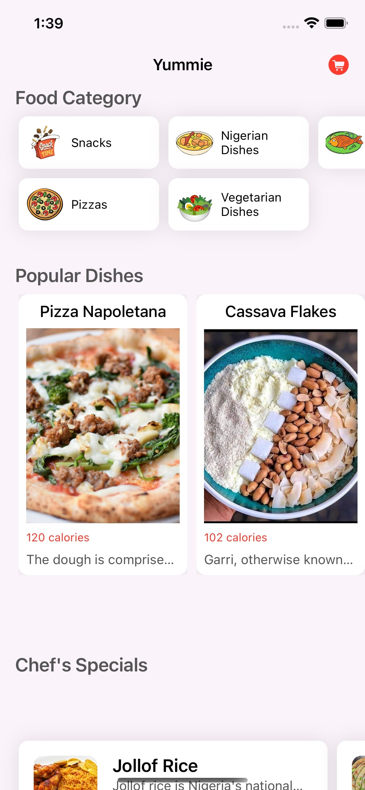
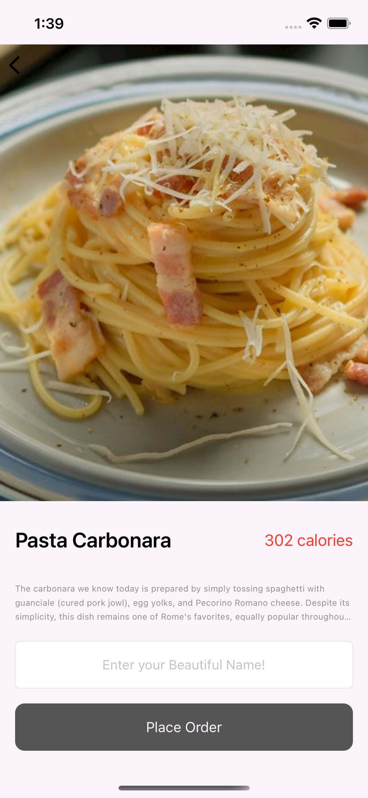
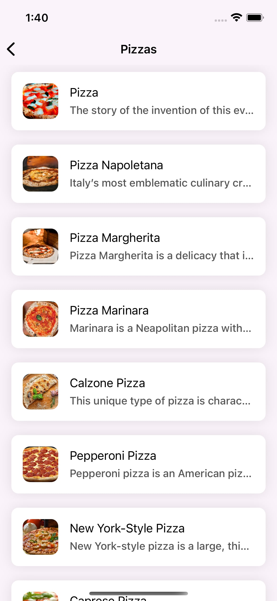
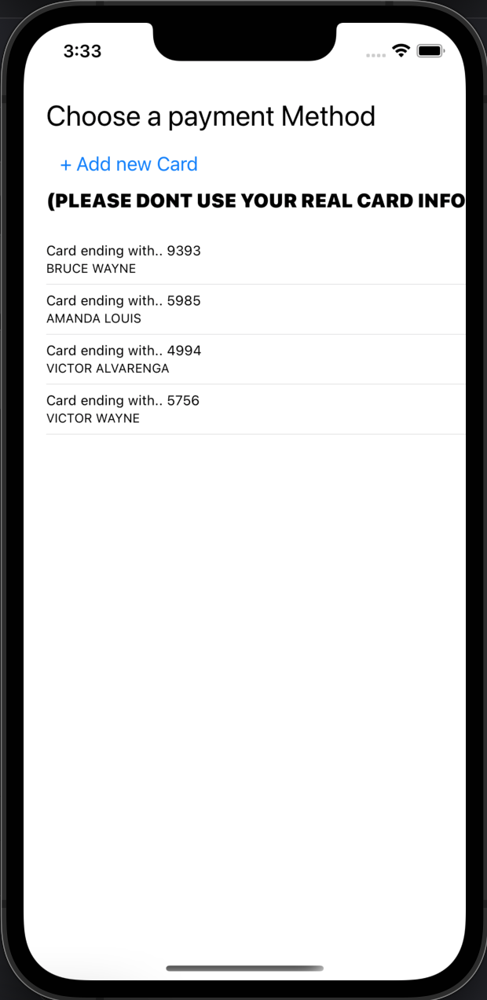
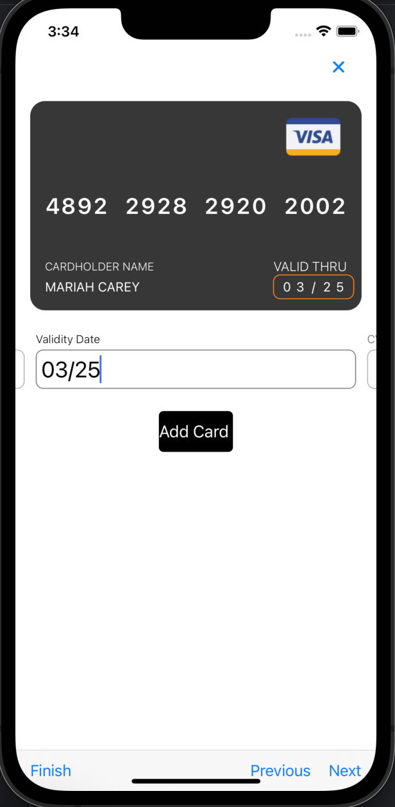

# FlashFood

# Description 
FlashFood is an app that uses mock Data to simulate a food delivery app using GET and POST URL Requests

  
   
  

## Payment Preview

  
   

# Features
- Simulate Food ordering
- Check past Orders
- Check Food Details (Just as Part of the recepies and calories)
- Track user's credit Card Info and accept Payments
# Tools used
- Postman (to host the API)
- Swift  (Programming Language used on the entire Project)
- CocoaPods (ProgressHUD, KingFisher, IQKeyboardManager)

You can Test this App On TestFlight using this link : https://testflight.apple.com/join/382Cm0Ej

